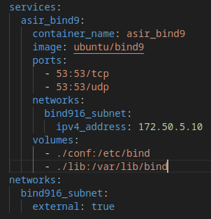
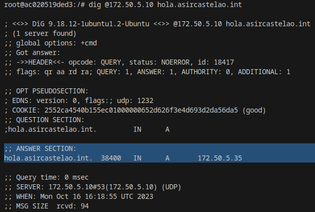
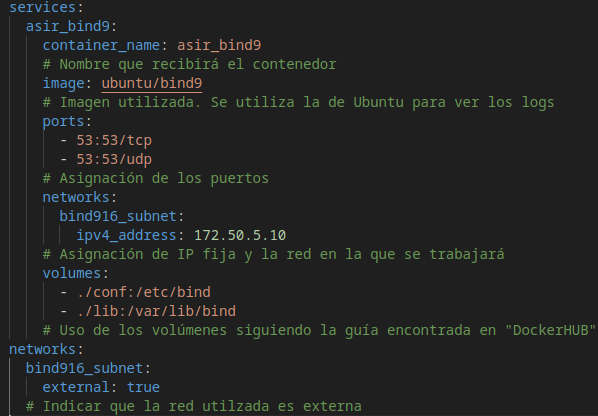

# Configuración del contenedor y sus volúmenes  

***Para crear la red se emplea el siguiente comando:***

    docker network create --driver=bridge --subnet=172.50.5.0/24 --gateway=172.50.5.1 bind916_subnet

# Comprobación de que el volumen funciona

# Explicación de los opciones de "Docker-Compose"

